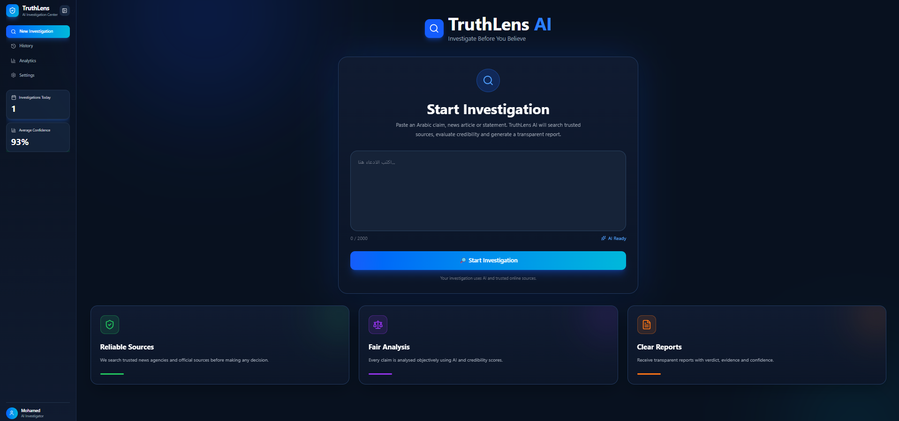
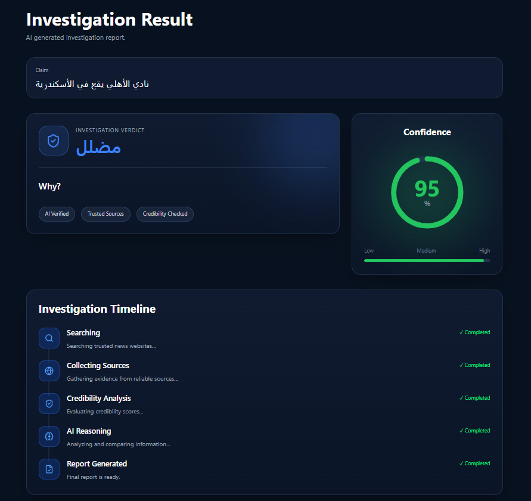
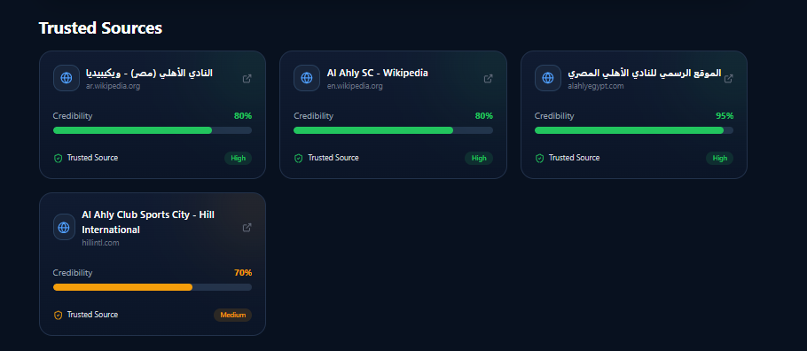
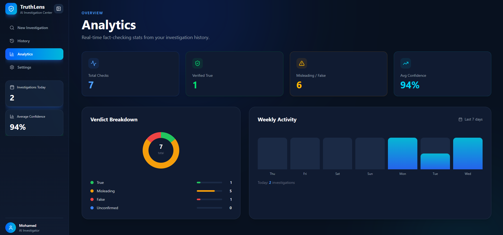

# 🚀 [Tips Hindawi](https://www.tipshindawi.com/) Challenge (June–July) 2026

> 🏆 This repository is my official submission for the [ **Tips Hindawi** ](https://www.tipshindawi.com/) **Challenge (June–July) 2026**.

## 👤 Participant

| Field            | Value                                |
| ---------------- | ------------------------------------ |
| Full Name        | Mohamed Mostafa Ahmed Hashem         |
| Project Name     | Arabic Fact Checker - TruthLens      |
| GitHub Username  | mohamedmostaffa                      |
| Challenge Batch  | June–July 2026                       |
| Training Program | Large Language Models (LLMs) Program |
| Organization     | [**Edrak for Ai**](https://edrak4ai.com/en)|

---

# 📖 Project Overview

Arabic Fact Checker is an AI-powered web application that verifies the credibility of Arabic claims using Large Language Models (Gemini), web search, and source credibility analysis. The system searches trusted sources, evaluates their reliability, and generates a structured fact-checking report in Arabic.

---

# ✨ Features

* Verify Arabic claims using Google Gemini.
* Search the web for relevant evidence.
* Evaluate source credibility.
* Generate structured Arabic fact-checking reports.
* Modern web interface for submitting claims.
* Modular provider architecture for future LLM support.

---

# 🛠️ Technologies Used

Python 3
FastAPI
Google Gemini API
HTML
CSS
JavaScript
Web Search API
Git & GitHub

---

# ⚙️ Installation

# Clone the repository
git clone https://github.com/mohamedmostaffa/final_project.git

cd final_project

# Install backend dependencies
pip install -r requirements.txt

# Create a .env file
GEMINI_API_KEY=YOUR_API_KEY

# Run the backend
python -m uvicorn backend.main:app --reload

# Run the frontend
cd frontend
npm install
npm run dev
---

# 🚀 Usage

1.Open the web application.
2.Enter an Arabic claim.
3.Submit the claim.
4.The system searches trusted sources.
5.Gemini analyzes the evidence.
6.A structured Arabic fact-checking report is displayed.

---

# 📸 Demo

## Home Page

## Fact Check Result

## Analytics

---

# 📈 Results

Open the web application.
Enter an Arabic claim.
Submit the claim.
The system searches trusted sources.
Gemini analyzes the evidence.
A structured Arabic fact-checking report is displayed.

---

# 🔮 Future Improvements

* Support multiple LLM providers (GPT, Claude, etc.).
* Add multilingual fact checking.
* Improve source ranking and credibility scoring.
* Save previous reports.
* User authentication and history.

---

# 📚 About the Challenge

This project was developed as part of the [**Tips Hindawi**](https://www.tipshindawi.com/) **Challenge (June–July) 2026**.

[Tips Hindawi](https://www.tipshindawi.com/) is the internships department of [**Edrak for Ai**](https://edrak4ai.com/en), and the challenge encourages participants to build real-world projects, apply practical skills, and showcase their work through GitHub.

For more information about the challenge, training programs, and upcoming batches, visit the official [Tips Hindawi](https://www.tipshindawi.com/) website.

---

# 📄 License

This project is shared for educational and portfolio purposes.
